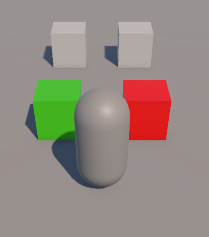
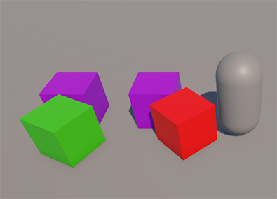

# 🎮 Unity Renk Eşleştirme Projesi (Unity Sınav1 Projesi)

---

## 🧩 Proje Amacı
Bu proje, **Unity** kullanarak temel sahne düzenleme, nesne hiyerarşisi oluşturma, materyal atama, etkileşimli tetikleme (trigger) kullanımı ve basit oyun mantığı geliştirme konularını içermektedir.  
Amaç, **renkli küplerin doğru renk alanlarına taşındığında puan toplanması ve tüm küpler doğru yere geldiğinde kazandın mesajı alınmasıdır.**

---

## 🏗️ Sahne ve Hierarchy Düzeni

| GameObject | Position (x,y,z) | Scale | Tag | Ek Bilgi |
|-------------|------------------|--------|------|-----------|
| Ground (Plane) | (0,0,0) | (2,2,2) | — | GrayMat atanır |
| Player (Capsule) | (-1,1,0) | (1,1,1) | — | Rigidbody + `PlayerMovement.cs` ekli |
| RedCube (Cube) | (0,0.5,2) | (1,1,1) | Red | Rigidbody ekli |
| GreenCube (Cube) | (-2,0.5,2) | (1,1,1) | Green | Rigidbody ekli |
| RedField (Cube) | (0,0.5,6) | (1,1,1) | dogruTag | Collider → “Is Trigger” ✔ + `ColorMatch.cs` |
| GreenField (Cube) | (-2,0.5,6) | (1,1,1) | dogruTag | Collider → “Is Trigger” ✔ + `ColorMatch.cs` |
| GameManager (Empty) | (0,0,0) | — | — | `GameManager.cs` eklenecek |

---

## 🎥 Main Kamera Ayarları
- Main Camera, **Player** objesinin **child** objesi yapılır.  
- **Local Position:** `(0, 4, -6)`  
- **Local Rotation:** `(45, 0, 0)`

---

## 🎨 Materyal Atamaları

| Material | Renk | Atanacağı Nesne |
|-----------|-------|----------------|
| RedMat | Kırmızı | RedCube |
| GreenMat | Yeşil | GreenCube |
| GrayMat | Gri | RedField, GreenField *(başlangıçta-yanlış eşleştiğinde-eşleşmediğinde)* |
| PurpleMat | Mor | RedField, GreenField *(doğru eşleştiğinde)* |

---

## ⚙️ Inspector Bağlantıları

| Nesne | Değer |
|--------|--------|
| RedField | `dogruTag = Red` |
| GreenField | `dogruTag = Green` |
| RedField & GreenField | `gameManager = GameManager` objesi |
| RedField & GreenField | `GrayMat = GrayMat` |
| RedField & GreenField | `PurpleMat = PurpleMat` |

---

## 🕹️ Kodlar

### 🧍‍♂️ PlayerMovement.cs
Oyuncunun W, A, S, D veya yön tuşlarıyla hareket etmesini sağlar.
```csharp
using UnityEngine;

public class PlayerMovement : MonoBehaviour
{
    [SerializeField] private float hiz = 5f;

    void Update()
    {
        float yatay = Input.GetAxis("Horizontal");
        float dikey = Input.GetAxis("Vertical");
        Vector3 hareket = new Vector3(yatay, 0, dikey);

        // Player'i yön tuşları ya da W,A,S,D tuşlarıyla hareket ettir
        transform.Translate(hareket * hiz * Time.deltaTime);
    }
}
```

---

# 🎨 ColorMatch.cs

## 🎯 Amaç
`ColorMatch` scripti, bir küpün doğru renk alanına yerleştirilip yerleştirilmediğini kontrol eder.  
Doğru eşleşme olduğunda alanın rengi değişir, konsola bilgi mesajı yazdırılır ve puan artırılır.  
Küp alandan çıktığında renk eski haline döner ve puan azalır.

---

## 🧩 Kod
```csharp
using UnityEngine;

public class ColorMatch : MonoBehaviour
{
    private bool eslesme = false;
    private Renderer rend;

    [Header("Tag Ayarı")]
    [SerializeField] private string dogruTag;

    [Header("GameManager Bağlantısı")]
    [SerializeField] private GameManager gameManager;

    [Header("Materyaller")]
    [SerializeField] private Material GrayMat;
    [SerializeField] private Material PurpleMat;

    private void Awake()
    {
        rend = GetComponent<Renderer>();
        rend.material = GrayMat;
    }

    private void OnTriggerEnter(Collider other)
    {
        if (other.CompareTag(dogruTag) && !eslesme)
        {
            eslesme = true;

            if (PurpleMat != null)
            {
                // Alanın materyalini mor yap
                rend.material = PurpleMat;
            }

            // Konsola bilgi yazdır
            Debug.Log(dogruTag + " küp doğru yere getirildi.");

            // Puan artır
            gameManager.puan++;
        }
    }

    private void OnTriggerExit(Collider other)
    {
        if (other.CompareTag(dogruTag) && eslesme)
        {
            eslesme = false;

            if (GrayMat != null)
            {
                // Alanın materyalini tekrar gri yap
                rend.material = GrayMat;
            }

            // Puan azalt
            gameManager.puan--;
        }
    }
}
```

---

# 🧮 GameManager.cs

## 🎯 Amaç
`GameManager` scripti, sahnedeki **puan sistemini** yönetir.  
Küplerin doğru alanlara yerleştirilmesiyle elde edilen puanları takip eder ve  
her iki küp de doğru yerdeyse oyuncuya **"Tüm küpler doğru yerde! Kazandın!"** mesajını verir.

---

## 🧩 Kod
```csharp
using UnityEngine;

public class GameManager : MonoBehaviour
{
    public int puan = 0;

    void Update()
    {
        if (puan >= 2)
        {
            // Tüm küpler doğru alandaysa
            Debug.Log("Tüm küpler doğru yerde! Kazandın!");
        }
    }
}
```

---

## 📁 Proje Klasör Yapısı

Aşağıda Unity projesi içinde Assets klasörünün düzeni gösterilmiştir:

```bash
Assets
├── Materials
│   ├── GrayMat.mat
│   ├── PurpleMat.mat
│   ├── GreenMat.mat
│   └── RedMat.mat
└── Scripts
    ├── PlayerMovement.cs
    ├── ColorMatch.cs
    └── GameManager.cs
```

---

## 🎮 Oyun Görselleri

<p align="center">
  
  
</p>
